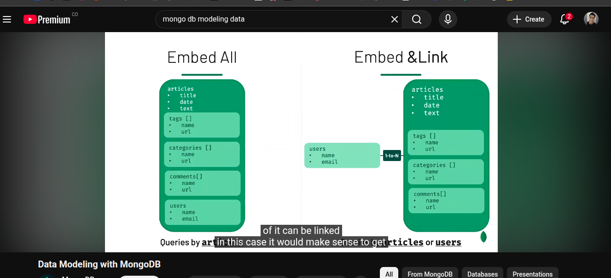

# ReviewApp

## Table of contents

- [Commands](./docs/commands.md)

- How often does the embedded information get accessed?
    
- Is the data queried using the embedded information?
  yes, it is
- Does the embedded information change often?
  it doesn't